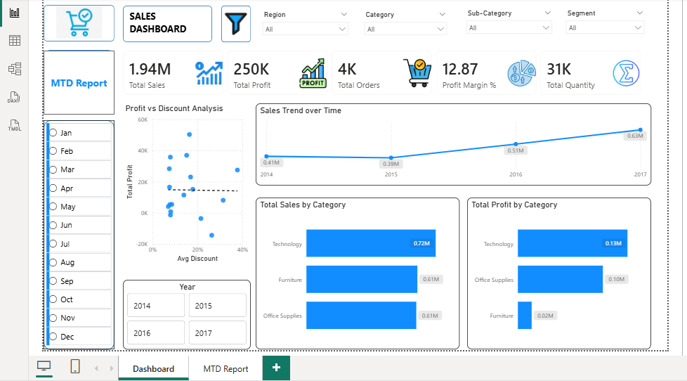
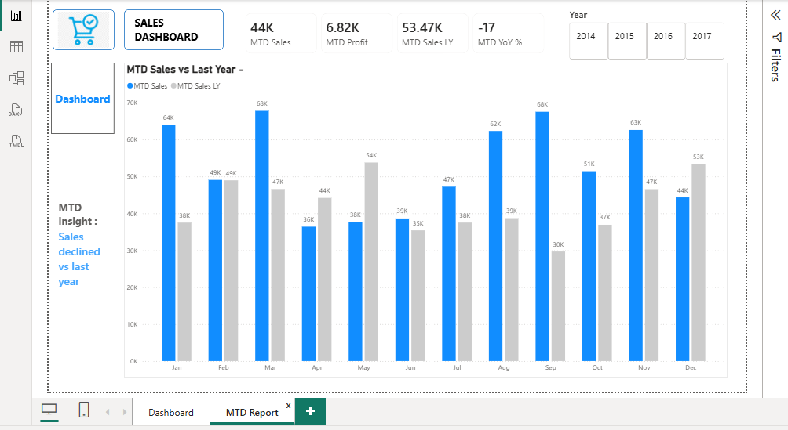

# 📊 Retail Sales Data Analysis & Validation

---

## 📌 Project Overview

This project focuses on analyzing retail sales data to uncover business performance trends and generate actionable insights.

The analysis emphasizes **data cleaning, validation, and business logic consistency** before building interactive dashboards.

The complete workflow was executed using **Excel (Power Query), SQL, and Power BI**, demonstrating an end-to-end analytics pipeline from raw data to executive-ready visualization.

---

## 🛠 Tools & Technologies Used

- 📗 **Excel (Power Query & Pivot Tables)** – Data cleaning and exploratory analysis  
- 🗄 **SQL** – Data validation, anomaly detection, and view creation  
- 📊 **Power BI** – Interactive dashboard development and KPI visualization  

---

## 📂 Dataset

The dataset used in this project is the **Superstore Sales dataset**, containing transactional retail data such as:

- Order Date  
- Ship Date  
- Sales  
- Profit  
- Region  
- Category  
- Customer Segment  

---

## 📁 Project Structure

- `Superstore.xlsx` → Raw Retail dataset & Excel cleaning & pivot analysis  
- `retail_sales.sql` → SQL queries & cleaned view  
- `retail_sales_dashboard.pbix` → Power BI interactive dashboard  
- `main-dasboard.png` → Dashboard screenshot
- `mtd-report.png` → MTD screenshot
-  `pivotinsight1.png`, `pivotinsight2.png`, `pivotinsight3.png`, `pivotinsight4.png`→ Pivot screenshots

---

## 🔎 Data Validation Process

During analysis, inconsistencies were identified where:

⚠ **Ship Date < Order Date**

To ensure data integrity:

- ✔ Data was validated using SQL  
- ✔ A cleaned view was created filtering valid records  
- ✔ Power BI dashboard was built using validated data only  

### 🧾 Validation Logic (SQL)

```sql
CREATE VIEW retail_sales_clean AS
SELECT *
FROM retail_data
WHERE ShipDate >= OrderDate; 
```
---

## 🔍 Key Business Insights

- 📈 Identified top-performing regions contributing the highest revenue.
- 📊 Analyzed monthly sales and profit trends to understand year-over-year growth.
- 🛍 Evaluated category-wise contribution to overall sales and profitability.
- 🚚 Assessed the impact of shipping inconsistencies on reporting accuracy.
- 👥 Compared sales performance across different customer segments.

---

## 📊 Dashboard Preview

### 🔹 Executive Sales Dashboard




---

## 📈 Dashboard Highlights

### 🧮 KPI Cards

- Total Sales  
- Total Profit  
- Total Orders  
- Profit Margin  
- Total Quantity  

### 📊 Visual Analysis

- 📅 Monthly Sales Trend  
- 🌍 Region-wise Performance  
- 📦 Category & Sub-Category Breakdown  
- 🎛 Interactive slicers for dynamic filtering  

---

## 💡 Business Recommendations

- 🎯 Focus marketing efforts on high-performing months to maximize revenue.
- 📉 Reevaluate discount policies to protect profit margins.
- 📦 Improve margin strategy for the Furniture category.
- 📊 Monitor underperforming months and investigate root causes.

---

## 🚀 Outcome

This project demonstrates the ability to:

✔ Perform structured data cleaning  
✔ Detect and correct data inconsistencies  
✔ Apply business validation logic  
✔ Build professional interactive dashboards  
✔ Deliver data-driven insights for data-driven decision making  

---
## Conclusion
In this project, I analyzed retail sales performance across multiple years. I validated data quality, ensured shipping logic accuracy, and built an interactive dashboard.
I identified that Technology is the primary revenue and profit driver, while high discounts negatively impact profitability.
The MTD report revealed a 17% decline compared to last year, indicating seasonal and performance-based fluctuations."


